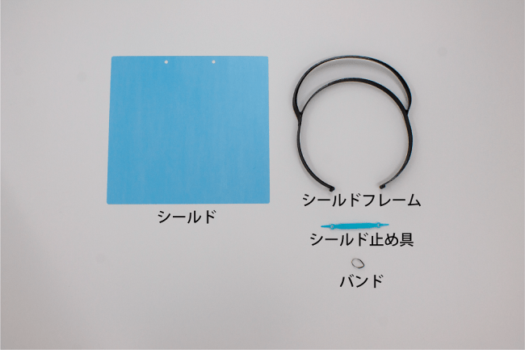
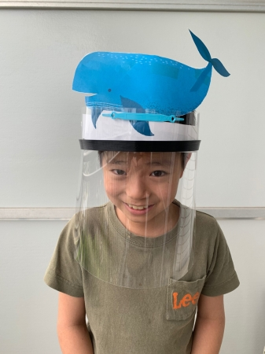
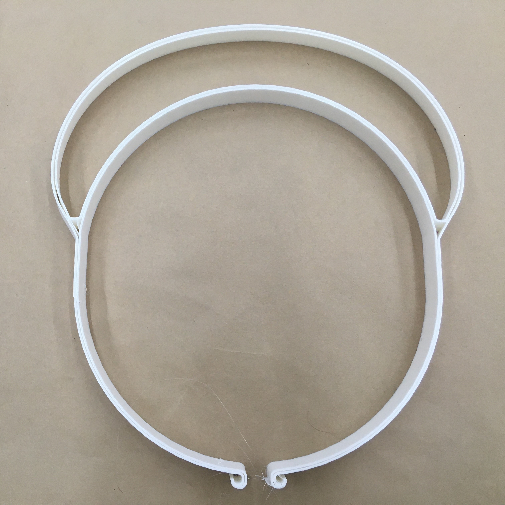
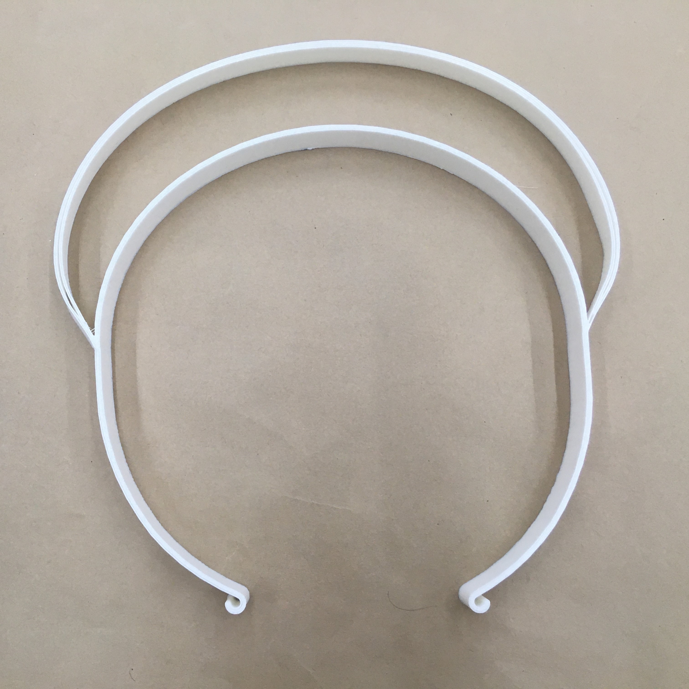
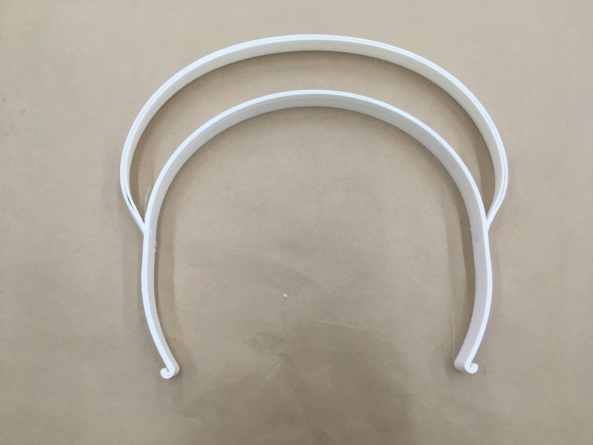
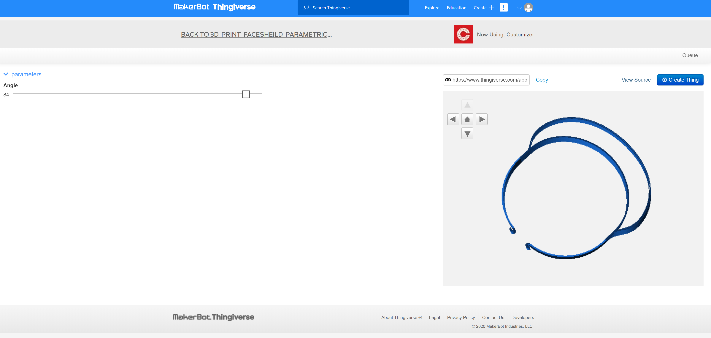
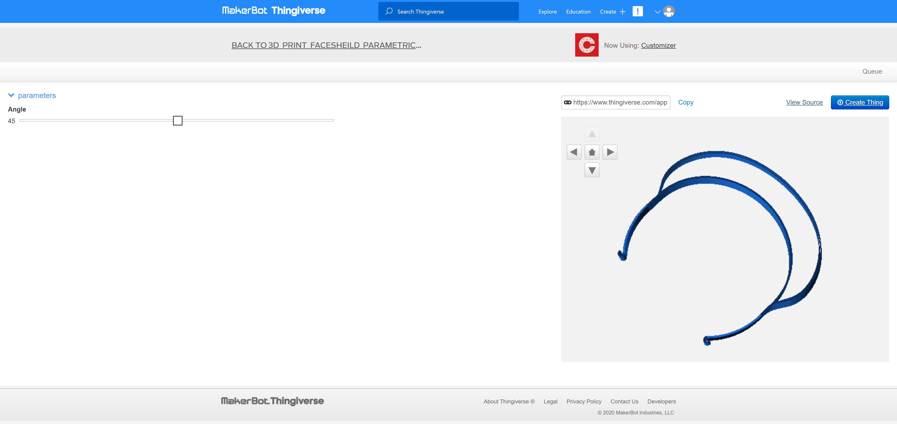
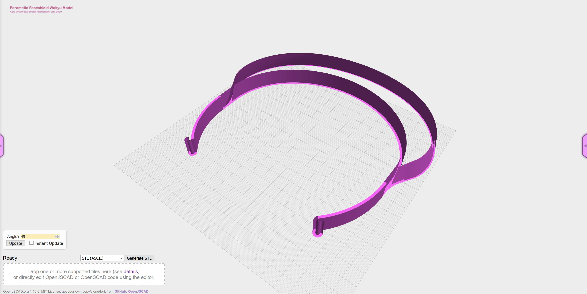

# はじめに - 3Dプリントフェイスシールド　Wakyu モデル  (学校用)

フェイスシールド 「Wakyu」 モデルは、幼稚園や学校での使用を想定した、3Dプリントでつくるオープンソースのフェイスシールドです。
慶應義塾大学SFC研究所ソーシャルファブリケーションラボ（代表：環境情報学部教授　田中浩也）の、湯浅亮平上席所員と、
ラボの卒業生で、現在はエス.ラボ株式会社に所属する脇本智正氏に共同設計され、両名の頭文字から「Wakyu」モデルと名付けられました。

S/M/Lのサイズを用意してあり、改変・配布・販売も可能です（下記のクリエイティブコモンズライセンスに準じてください）。
シールドの上部に「着せ替えシート」を取り付け、ワンポイントのカスタマイズができる設計となっています。

みなさまの使っている姿を見せていただいたり、感想をお寄せいただけいただけるのであれば、SNSで#wakyumodel とハッシュタグをつけて投稿もしくは、
tanakalab-sfc@googlegroups.com にお願いいたします。カスタマイズのアイディアや、実際に使用している姿を見せていただけると大変嬉しいです。

田中浩也/ 湯浅亮平 / 脇本智正

# 3Dデータの説明

フォルダに公開したデータのうち「Wakyu_Large.stl」が大サイズ、「Wakyu_Middle.stl」が中サイズ、「Wakyu_Small.stl」が小サイズになっています。
どのデータも「透明シールド」を差し込むための溝の設計がカギです。スライス時に、その「溝」をサポート材で埋めたりせずに、かつ寸法通り正しい幅で出力するために、3Dプリンタのノズルは0.4mmを強くお勧めします。

# 共同設計パートナー

エス．ラボ株式会社（高速ペレット式３Dプリンタ群「３Dプラント」を用いた高速量産）
http://slab.jp/

# 使用可能なフィラメント

繰り返し使用するためには高温消毒・アルコール消毒が可能で、かつ頭部に柔らかいPP (ポリプロピレン）が有力であると考えられます。
PP (ポリプロピレン）のフィラメントのうち、安定した3Dプリントを行うために収縮抑制のグラスウールを混ぜたナノダックス社の「3D-MAGIC」をお勧めします。
http://nanodax.jp/3Dfilament.html

# 作ったものを他人に渡す場合の注意
[フェイスシールドを安全に作って渡すためのガイドラインドキュメント](https://fabsafehub.org/faceshield)

# パラメトリック・モデル (Thingiverse Customizr機能への公開)

頭のうらの「つる」の部分の長さだけを自由に改変できる、パラメトリック・モデルを作成し、世界的な3Dデータレポジトリ「Thingiverse」に公開しました（ベータ版です）。https://www.thingiverse.com/thing:4431372

「Customizer」という機能を使うことで自由につるの長さを変更できます。

# パラメトリック・モデル (独自のカスタマイズサイトの開発) ※開発中

独自のパラメトリック・モデル改変インターフェイスを研究開発中です。

https://fab.sfc.keio.ac.jp/openjscad/packages/web/

# 印刷設定(スライサーの設定)

フェイスシールドを一般的なフィラメントタイプのプリンターでプリントするには細かな印刷設定が必要です。
いくつかのパラメータを変更することで、印刷時間を短縮し、より仕上がりが良く着け心地の良いフレームをプリントする事ができます。
２つのスライサーのお勧めする印刷設定を紹介します。
[Simplify3D] (https://www.simplify3d.com/)

[Ultimaker Cura](https://ultimaker.com/ja/software/ultimaker-cura) 

# シールドカット(型紙)
多くの方にお使い頂けるよう、シールド部分は大きめに作成しております。
カットをするための型紙を用意いたしましたので、ダウンロードしプリントしてお使いください。
A3用紙で印刷することで、適切な型紙サイズとしてお使い頂けます。
